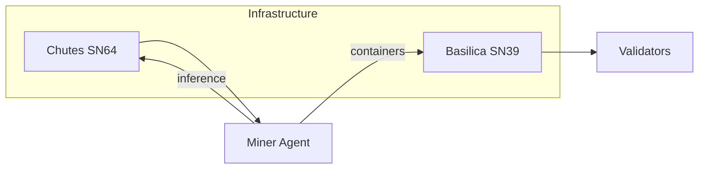
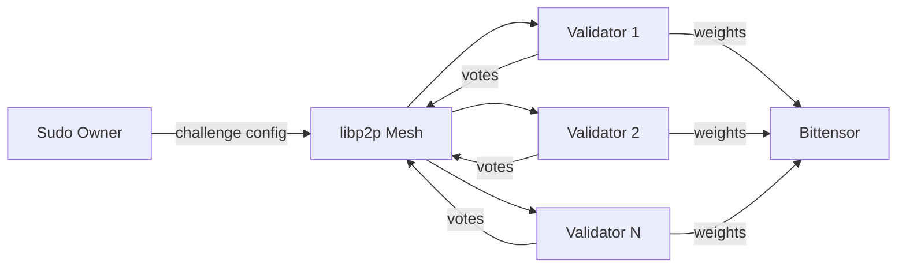
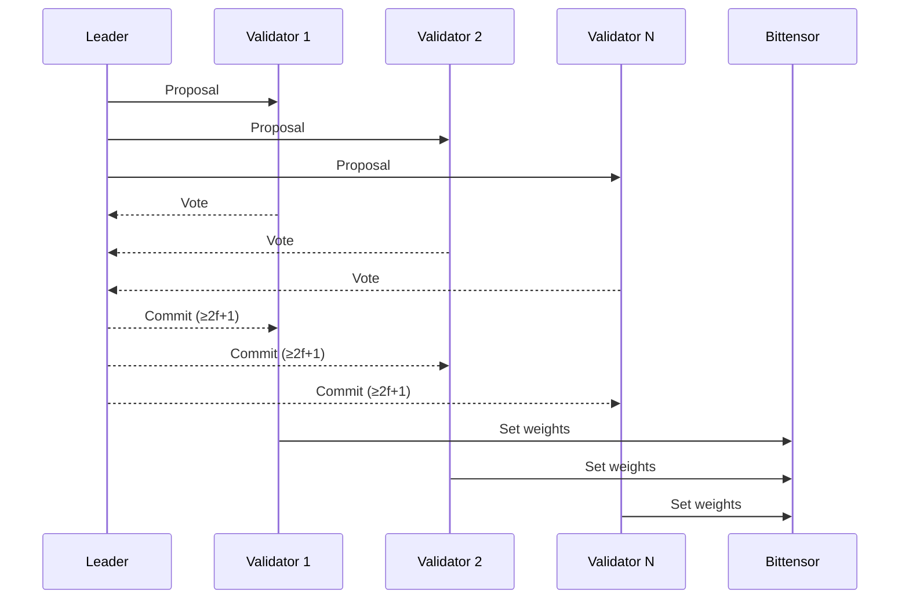
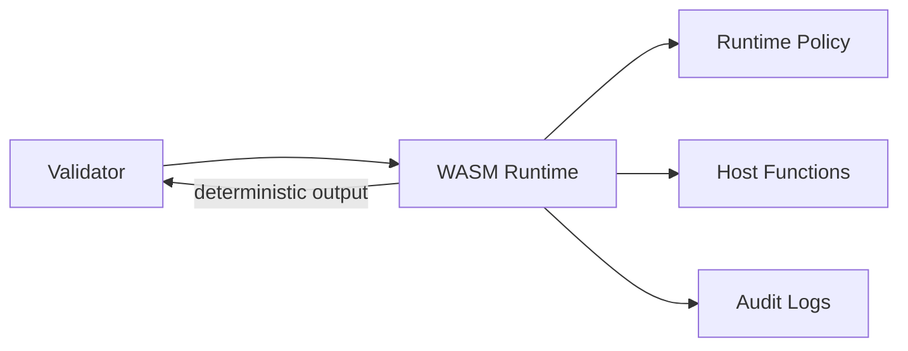
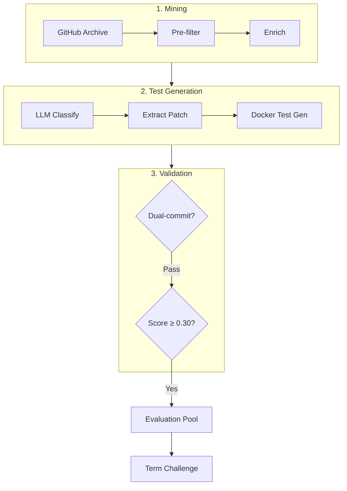
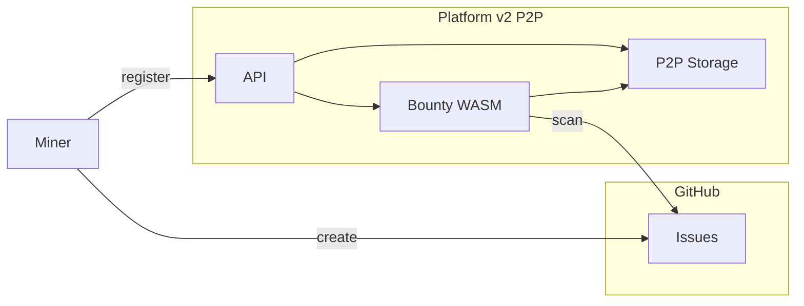

# ρlατfοrm

**Roadmap for Subnet 100. Distributed validator network for decentralized AI evaluation on Bittensor**

---

## Table of Contents

1. [Overview](#overview)
2. [Network Architecture](#network-architecture)
   - [Platform v2 — P2P Validator Network](#platform-v2--p2p-validator-network)
3. [Challenges](#challenges)
   - [Term Challenge](#term-challenge--agent-harness-competition)
     - [swe-forge — Preventing Overfitting](#synthetic-evaluation-with-swe-forge--preventing-overfitting)
   - [Bounty Challenge](#bounty-challenge--bug-discovery-and-software-improvement)
   - [Data Fabrication Challenge](#data-fabrication-challenge--synthetic-coding-dataset-production-q2-2026)
4. [Unified Scoring Framework](#unified-scoring-framework)
5. [The Model — Agentic Coding LLM](#the-model--agentic-coding-llm)
6. [Tokenomics and Monetization Flywheel](#tokenomics-and-monetization-flywheel)
7. [Roadmap](#roadmap)
8. [Repository Index](#repository-index)

---

## Overview

Platform Network operates as **Subnet 100** on the Bittensor blockchain. It is a decentralized incentive layer with two long-term objectives: building the best agentic coding software competing directly with existing tools in the market ([Cortex CLI](https://github.com/CortexLM/cortex) and [Cortex IDE](https://github.com/CortexLM/cortex-ide)), and training our own agentic coding language model by leveraging [GRAIL](https://github.com/one-covenant/grail) (Subnet 81) with datasets produced by network miners. The competitive challenge system aligns miner incentives with both goals: improving the software through harness competitions and bug bounties, while simultaneously fabricating the training data that will power the model.

The core infrastructure is implemented in [platform-v2](https://github.com/PlatformNetwork/platform-v2), a fully decentralized peer-to-peer validator network built in Rust. Validators execute challenge logic inside a hardened WASM runtime, reach stake-weighted consensus over libp2p, and submit finalized weights to the Bittensor chain.

The challenge execution layer relies on two external Bittensor subnets. [Basilica](https://github.com/one-covenant/basilica) (Subnet 39) provides decentralized GPU compute for hosting miner agents in isolated containers. [Chutes](https://github.com/chutesai/chutes) (Subnet 64) provides the LLM inference layer used by agents during challenge evaluation. Together, Basilica and Chutes form the compute backbone that powers all challenge execution on Platform Network.

---

## Network Architecture

Miners interact with three challenge modules hosted on the platform-v2 validator network. Each challenge produces measurable outputs (scores, valid issues, datasets) that validators aggregate through P2P consensus before submitting weights to the Bittensor chain. TAO emissions flow back to miners in proportion to their performance, completing the incentive loop.

### Platform v2 — P2P Validator Network

**Repository:** [PlatformNetwork/platform-v2](https://github.com/PlatformNetwork/platform-v2)

Platform v2 is the backbone of the entire subnet. It is a fully decentralized peer-to-peer validator network where validators form a libp2p mesh, execute challenge logic in a sandboxed WASM runtime, and reach stake-weighted PBFT-style consensus before submitting finalized weights to the Bittensor chain. There is no centralized relay. Every validator independently verifies miner submissions and participates in consensus.

The consensus protocol follows a PBFT-style flow. A leader proposes an action at a given height, all validators vote to approve or reject, and once $\geq 2f+1$ approvals are collected the action is committed and weights are submitted on-chain.

Challenge logic runs inside a hardened WASM runtime with strict runtime policy. Each challenge is a compiled WASM module loaded by validators. The runtime enforces deterministic outputs, whitelisted host functions, and full audit logging.

---

## Challenges

Platform Network hosts dynamic challenges, each targeting a distinct aspect of software development quality. Challenges are implemented as WASM modules that run inside the platform-v2 validator runtime, ensuring deterministic and verifiable evaluation.

### Term Challenge — Agent Harness Competition

**Repository:** [PlatformNetwork/term-challenge-v2](https://github.com/PlatformNetwork/term-challenge-v2)

Term Challenge is the flagship competition of Platform Network. Miners submit Python agent packages that autonomously solve software engineering tasks drawn from SWE-bench datasets. The network evaluates these agents through a multi-stage review pipeline combining LLM-based code review and AST structural validation, executed by six deterministically selected validators per submission.

#### Submission Flow

The submission process enforces rate limiting (1 submission per 3 epochs per miner), size constraints (ZIP packages capped at 1 MB), and cryptographic authentication via sr25519 signatures. Each submission is versioned automatically under a first-register-owns naming system.

#### Validator Assignment

For each submission, six validators are deterministically selected from a seed derived from the submission ID. Three perform LLM-based code review and three perform AST structural analysis. If any reviewer times out, a replacement validator is automatically assigned, ensuring liveness.

#### Decay Mechanism

The decay function ensures no miner can rest on a single high-scoring submission. The weight multiplier $\mu(t)$ governs the time-dependent emission allocation:

$$
\mu(t) = \begin{cases}
1.0 & \text{if } t \leq 72\text{h (grace period)} \\[6pt]
2^{-\frac{t - 72}{24}} & \text{if } t > 72\text{h}
\end{cases}
$$

The effective weight $w_i$ for miner $i$ with raw score $s_i$ is:

$$
w_i = s_i \cdot \mu(t_i)
$$

After 72 hours of grace and 24 hours of decay ($t = 96$), the multiplier drops to $\mu(96) = 2^{-1} = 0.5$. After a further 24 hours ($t = 120$), it reaches $\mu(120) = 2^{-2} = 0.25$. The weight asymptotically approaches zero, eventually burning to UID 0.

#### Agent Code Storage and Log Consensus

Submitted agent packages (up to 1 MB) are stored on-chain with hash verification. Evaluation logs are proposed by validators and validated through P2P consensus with a majority hash agreement threshold exceeding 50%.

#### Synthetic Evaluation with swe-forge — Preventing Overfitting

**Repository:** [CortexLM/swe-forge](https://github.com/CortexLM/swe-forge)

A critical weakness of static benchmarks like SWE-bench is that agents can overfit to known tasks. If the evaluation dataset never changes, miners can memorize solutions rather than build genuinely capable agents. swe-forge solves this by continuously generating fresh, never-before-seen SWE-bench-style tasks from real-world GitHub pull requests in real time.

The pipeline mines GitHub Archive for recently merged PRs, enriches them with repository metadata, classifies difficulty via LLM, extracts patches, and generates tests inside Docker-isolated containers through a multi-turn agentic loop (up to 200 turns of tool use). Every generated task is validated through a dual-commit process: tests must fail on the pre-PR commit and pass on the post-PR commit. Only tasks that survive this validation and pass a quality score threshold ($\geq 0.30$) are accepted into the evaluation pool.

This means the Term Challenge evaluation set is a moving target. Every term, agents face tasks they have never encountered before, drawn from real software projects across multiple languages (Python, Go, Java, TypeScript, Rust). Overfitting to a static benchmark becomes impossible because the benchmark itself is continuously regenerated.

---

### Bounty Challenge — Bug Discovery and Software Improvement

**Repository:** [PlatformNetwork/bounty-challenge](https://github.com/PlatformNetwork/bounty-challenge)

Bounty Challenge takes a different approach to incentivizing software quality. Rather than competing on agent performance, miners earn rewards by discovering and reporting valid bugs, security vulnerabilities, and improvement suggestions for the Cortex software ecosystem. Issues must be submitted to the bounty-challenge repository, reviewed by project maintainers, and closed with a `valid` label to qualify for rewards.

#### Registration and Authentication

Miners register by linking their GitHub username to their Bittensor hotkey via an sr25519 cryptographic signature. The registration is a one-time process that binds on-chain identity to GitHub identity, enabling automatic attribution of issues to miners.

#### Platform Integration Architecture

Bounty Challenge runs as a WASM module inside the platform-v2 P2P validator network. Validators auto-scan GitHub issues, verify labels, reach consensus over the P2P mesh, compute weights within a 24-hour rolling window, and submit them to the Bittensor chain.

#### Weight Calculation Formula

The weight assigned to each miner operates within a 24-hour rolling window. The penalty is computed independently for invalid and duplicate issues. Each miner's valid issue count acts as a separate shield for each penalty type:

$$
p_i = \underbrace{\max(0,\; n_i - v_i)}_{\text{invalid penalty}} + \underbrace{\max(0,\; d_i - v_i)}_{\text{duplicate penalty}}
$$

$$
\pi_i = v_i + b_i - p_i \quad\text{where}\quad b_i = \begin{cases} 0.25 \times |\text{starred repos}| & \text{if } v_i \geq 2 \\ 0 & \text{otherwise} \end{cases}
$$

$$
w_i = \max(0,\; \pi_i) \times 0.02
$$

The star bonus $b_i$ caps at 1.25 points (5 repositories at 0.25 each) and requires a minimum of 2 valid issues to activate. Anti-abuse mechanisms include label protection via GitHub Actions, first-reporter-wins deduplication, and maintainer gatekeeping.

---

### Data Fabrication Challenge — Synthetic Coding Dataset Production (Q2 2026)

The third challenge, planned for launch in **Q2 2026**, incentivizes miners to produce the best harnesses for fabricating synthetic coding datasets. Miners compete to build and submit data generation pipelines (harnesses) that autonomously produce high-quality training data specialized in code understanding, generation, and reasoning tasks. Validators execute these harnesses in sandboxed environments and evaluate the quality, diversity, and correctness of the resulting synthetic datasets through automated metrics and cross-validation. The better the harness performs at generating useful coding data, the higher the miner's weight and TAO earnings.

The datasets produced through this challenge serve a strategic purpose: they become the training fuel for fine-tuning language models through the GRAIL protocol, creating a direct pipeline from decentralized data production to verifiable model improvement.

#### Data Fabrication Pipeline

#### Quality Scoring

The composite quality score for each harness submission combines three orthogonal metrics. Let $\mathcal{D}_i$ be the dataset produced by miner $i$'s harness:

$$
Q_i = \alpha \cdot C(\mathcal{D}_i) + \beta \cdot D(\mathcal{D}_i) + \gamma \cdot U(\mathcal{D}_i)
$$

where:

$$
C(\mathcal{D}_i) \in [0, 1] \quad \text{(correctness: syntactic validity, executability, annotation accuracy)}
$$

$$
D(\mathcal{D}_i) \in [0, 1] \quad \text{(diversity: language coverage, paradigm variety, difficulty spread)}
$$

$$
U(\mathcal{D}_i) \in [0, 1] \quad \text{(utility: downstream training signal, measured via held-out validation)}
$$

The weighting coefficients satisfy $\alpha + \beta + \gamma = 1$ and are tunable by the subnet owner to steer miner incentives toward the most needed dataset characteristics at any given time.

---

## Unified Scoring Framework

All three challenges share a common weight normalization step before submission to the Bittensor chain. Let $w_i^{(c)}$ denote the raw weight of miner $i$ in challenge $c$, and let $\epsilon_c$ denote the emission allocation for challenge $c$ (configured by the subnet owner such that $\sum_c \epsilon_c = 1$). The final normalized weight for miner $i$ across the entire subnet is:

$$
W_i = \sum_{c \in \mathcal{C}} \epsilon_c \cdot \frac{w_i^{(c)}}{\sum_{j} w_j^{(c)}}
$$

where $\mathcal{C} = \{\text{Term}, \text{Bounty}, \text{DataFab}\}$. This formulation allows the subnet owner to dynamically rebalance incentives across challenges. For instance, setting $\epsilon_{\text{Term}} = 0.5$, $\epsilon_{\text{Bounty}} = 0.2$, $\epsilon_{\text{DataFab}} = 0.3$ allocates half of emissions to the agent harness competition while directing 30% toward dataset production.

The effective weight for Term Challenge incorporates the decay multiplier $\mu(t_i)$, meaning that $w_i^{(\text{Term})} = s_i \cdot \mu(t_i)$ where $s_i$ is the raw evaluation score. For Bounty Challenge, $w_i^{(\text{Bounty})} = \max(0, \pi_i) \times 0.02$ where $\pi_i$ is the net point value. For Data Fabrication, $w_i^{(\text{DataFab})} = Q_i$ the composite quality score.

---

## The Model — Agentic Coding LLM

The end goal of Platform Network is to train a dedicated **agentic coding language model**. This model will be purpose-built for autonomous software engineering tasks: understanding codebases, generating patches, reasoning about architecture, and executing multi-step development workflows. It is the model that will power Cortex CLI and Cortex IDE, and it is the primary monetization vehicle for the entire ecosystem.

The training pipeline flows through three stages: data production on Subnet 100, verifiable post-training on Subnet 81, and commercial deployment through the Cortex products.

**Stage 1: Data Production (Subnet 100).** The Data Fabrication Challenge incentivizes miners to produce the best harnesses for generating synthetic coding datasets. These datasets cover code understanding, generation, debugging, refactoring, and multi-file reasoning tasks. Validators execute the harnesses in sandboxed environments and score the output along correctness, diversity, and utility axes. Only datasets that pass quality validation are forwarded to the training stage.

**Stage 2: Verifiable Post-Training (GRAIL — Subnet 81).** The validated coding datasets feed into the [GRAIL protocol](https://github.com/one-covenant/grail) (*Guaranteed Rollout Authenticity via Inference Ledger*), operated independently by the One Covenant team on Subnet 81. GRAIL performs reinforcement learning post-training with cryptographically verifiable inference. Every rollout produced during RL is bound to a specific model and input through PRF-based commitments, ensuring no substitution or replay. Formally, for a rollout $r$ produced by model $M$ on input $x$:

$$
\text{Commit}(r, M, x) = \text{PRF}_k\big(\text{sketch}(r) \;\|\; \text{hash}(M) \;\|\; \text{hash}(x)\big)
$$

where $k$ is derived from the verifier-supplied challenge (drand randomness combined with the window's block hash). This guarantees that every training step is auditable and that the resulting model weights are provably the product of the claimed training data.

**Stage 3: Monetization via Cortex Products.** The fine-tuned agentic coding LLM is deployed as the default model inside Cortex CLI and Cortex IDE. Users access the model through subscriptions (individual and enterprise licenses). The model can also be exposed as a standalone API for third-party integrations. Revenue generated from model usage flows back into the ecosystem through TAO buybacks and reinvestment in new challenges, closing the loop between data production, model training, and commercial value.

This pipeline means that every miner contributing to the Data Fabrication Challenge is directly improving the model that generates revenue for the network. The better the datasets, the better the model. The better the model, the more customers. The more customers, the stronger the incentives for miners to produce even better datasets.

---

## Tokenomics and Monetization Flywheel

Platform Network's economic model creates a self-sustaining cycle connecting software development, market adoption, and network incentives. The flywheel operates through four interconnected stages.

**Stage 1: Software Development.** The challenges hosted on Platform Network (Term Challenge, Bounty Challenge, Data Fabrication Challenge) directly improve the quality of Cortex CLI and Cortex IDE. Miners competing to produce the best agent harnesses drive performance improvements. Bug bounty participants eliminate defects and security vulnerabilities. Dataset producers create the training data that fine-tunes the underlying language models.

**Stage 2: Marketing.** Superior software products create organic traction. The competitive nature of the challenges generates community engagement and visibility within the Bittensor ecosystem and the broader developer tools market.

**Stage 3: Customers.** As Cortex CLI and Cortex IDE reach production quality (estimated end of March 2026), the monetization layer activates through subscriptions and enterprise licenses. The tools' quality, continuously improved by network participants, directly determines conversion and retention.

**Stage 4: Revenue and Reinvestment.** Generated revenue flows into three channels. A portion is allocated to **TAO buyback**, creating demand pressure on the token and increasing the value of emissions received by miners. A portion funds **marketing expansion**, accelerating user acquisition. The remainder funds **development acceleration**, enabling the subnet owner to launch new challenges and expand the software ecosystem.

The buyback mechanism is particularly important for token economics. Let $R$ denote monthly revenue, $\phi_b$ the buyback allocation ratio, and $P_{TAO}$ the market price of TAO. The monthly buyback volume $V_b$ is:

$$
V_b = \frac{R \cdot \phi_b}{P_{TAO}}
$$

This creates a positive feedback loop: as software quality improves through network incentives, revenue grows, buyback volume increases, token value appreciates, emission value rises, and miner incentives strengthen — attracting more competitive participants and further improving software quality.

---

## Roadmap

The Cortex CLI was released on January 18, 2026, establishing the foundational command-line agent for the ecosystem. The Cortex IDE followed on February 20, 2026, providing a full graphical development environment. On February 21, 2026, Platform v2 and Term Challenge v2 launch together, marking the transition to a fully decentralized WASM-only validator architecture. Bounty Challenge v2 deploys in the same period with updated scoring mechanics and P2P-backed storage.

Both Cortex CLI and Cortex IDE are targeted for production release at the end of March 2026, marking their readiness for commercial deployment.

In Q2 2026, the Data Fabrication Challenge goes live, opening a new competitive frontier where miners produce coding datasets optimized for model training. The GRAIL integration pipeline follows, with validated datasets flowing into the GRAIL verifiable post-training system on Subnet 81, producing the first fine-tuned language models purpose-built for the Cortex ecosystem.

---

## Repository Index

| Repository | Description |
|---|---|
| [PlatformNetwork/platform-v2](https://github.com/PlatformNetwork/platform-v2) | WASM-only P2P validator network for distributed evaluation on Bittensor |
| [PlatformNetwork/term-challenge-v2](https://github.com/PlatformNetwork/term-challenge-v2) | Terminal benchmark challenge — WASM evaluation module for agent harness competition |
| [PlatformNetwork/bounty-challenge](https://github.com/PlatformNetwork/bounty-challenge) | GitHub issue reward system for bug discovery and software improvement |
| [CortexLM/swe-forge](https://github.com/CortexLM/swe-forge) | Synthetic SWE-bench task generation from real-time GitHub PRs for overfitting-proof evaluation |
| [CortexLM/cortex](https://github.com/CortexLM/cortex) | Agent-native development CLI written in Rust |
| [CortexLM/cortex-ide](https://github.com/CortexLM/cortex-ide) | AI-powered IDE built with Tauri v2 (SolidJS + Rust) |
| [one-covenant/basilica](https://github.com/one-covenant/basilica) | Decentralized GPU compute for container hosting (Subnet 39, external team) |
| [chutesai/chutes](https://github.com/chutesai/chutes) | Decentralized LLM inference platform (Subnet 64, external team) |
| [one-covenant/grail](https://github.com/one-covenant/grail) | Verifiable post-training for LLMs via the GRAIL protocol (Subnet 81, external team) |

---

## License

MIT
